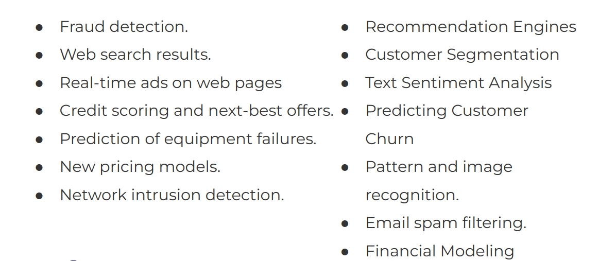
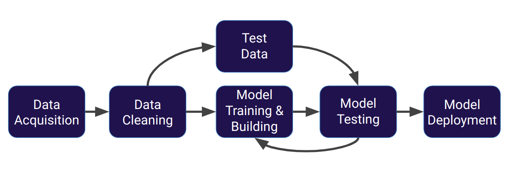
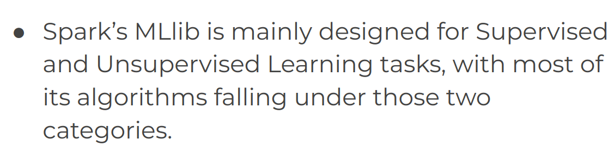
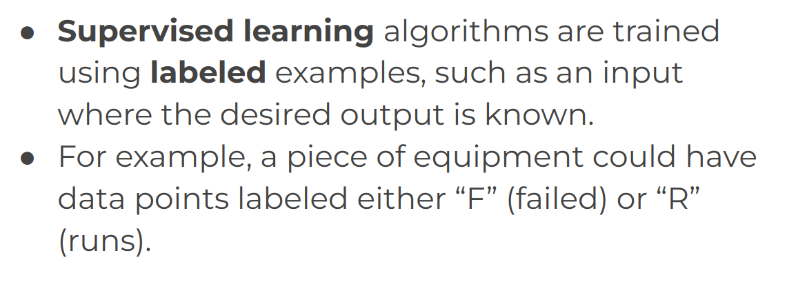
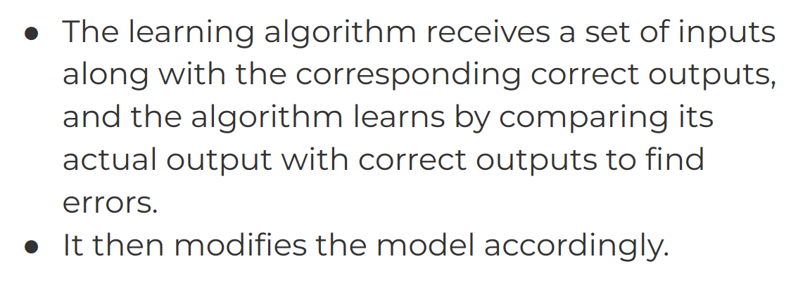
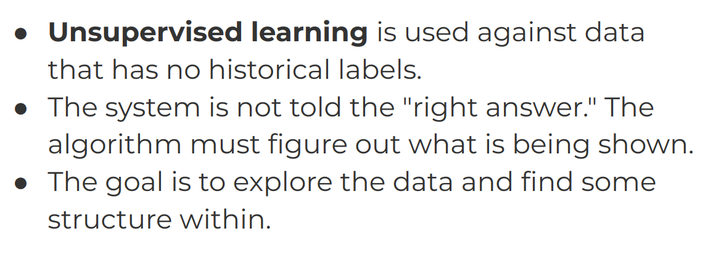

# 4-ML-with-MLLib

1. [Introduction to ML and ISLR](#schema1)
2. [Machine Learning with Spark and Python with MLlib](#schema3)

## 1. Introduction to ML and ISLR

- En que se usa
- 

- Proceso

### Supervisado o no supervisado
El aprendizaje supervisado y no supervisado son dos enfoques fundamentales en el campo del aprendizaje automático 
(machine learning). Aquí hay algunas diferencias clave entre ambos:

Definición:

Aprendizaje Supervisado: En el aprendizaje supervisado, el modelo se entrena con un conjunto de datos que incluye 
ejemplos de entrada y la salida esperada asociada. El objetivo es aprender una función que mapee las entradas a las 
salidas.
Aprendizaje No Supervisado: En el aprendizaje no supervisado, el modelo se entrena en un conjunto de datos que no 
incluye salidas esperadas. El modelo debe descubrir patrones o estructuras en los datos por sí mismo.

Etiquetas de Datos:

Aprendizaje Supervisado: El conjunto de datos de entrenamiento incluye ejemplos emparejados de entrada 
y salida (etiquetas). El modelo se ajusta para predecir las salidas correctas.
Aprendizaje No Supervisado: El conjunto de datos de entrenamiento no incluye salidas etiquetadas. 
El modelo debe encontrar patrones o estructuras inherentes en los datos.

Objetivo:

Aprendizaje Supervisado: El objetivo principal es hacer que el modelo haga predicciones precisas sobre datos 
no vistos después del entrenamiento.
Aprendizaje No Supervisado: El objetivo principal es descubrir patrones, relaciones o estructuras ocultas en 
los datos sin tener salidas conocidas.

Ejemplos de Aplicaciones:

Aprendizaje Supervisado: Clasificación y regresión son tareas comunes en aprendizaje supervisado. 
Ejemplos incluyen reconocimiento de imágenes, detección de spam y predicción de precios de acciones.
Aprendizaje No Supervisado: Agrupamiento (clustering) y reducción de dimensionalidad son tareas comunes en 
aprendizaje no supervisado. Ejemplos incluyen segmentación de clientes, análisis de temas en documentos y reducción de dimensionalidad para visualización de datos.

Evaluación del Modelo:

Aprendizaje Supervisado: La precisión del modelo se evalúa comparando las predicciones del modelo con las 
salidas reales en el conjunto de datos de prueba.
Aprendizaje No Supervisado: La evaluación puede ser más subjetiva y depende de la tarea específica. 
Por ejemplo, en agrupamiento, se puede evaluar la coherencia de los grupos formados.

Naturaleza de los Datos:

Aprendizaje Supervisado: Los datos de entrenamiento deben estar etiquetados, lo que significa que se requiere una 
inversión de tiempo y esfuerzo para recopilar y etiquetar datos.
Aprendizaje No Supervisado: Los datos de entrenamiento no requieren etiquetas, lo que puede facilitar la recopilación 
de datos, pero puede hacer que la evaluación del modelo sea más desafiante.
En resumen, mientras que el aprendizaje supervisado se centra en predecir salidas específicas, el aprendizaje 
no supervisado se centra en descubrir patrones y estructuras en los datos sin tener salidas etiquetadas. 
Ambos enfoques tienen aplicaciones únicas y se utilizan según la naturaleza de los datos y los objetivos del problema.

- Supervised Learning

- Unsupervised Learning
 

## 2. Machine Learning with Spark and Python with MLlib

